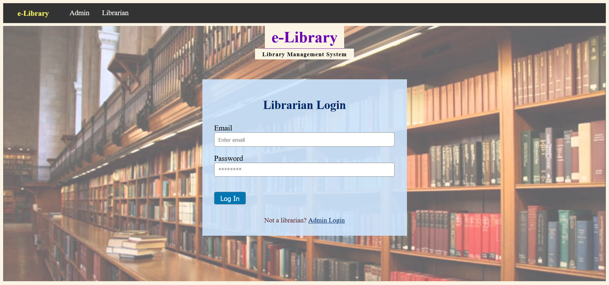
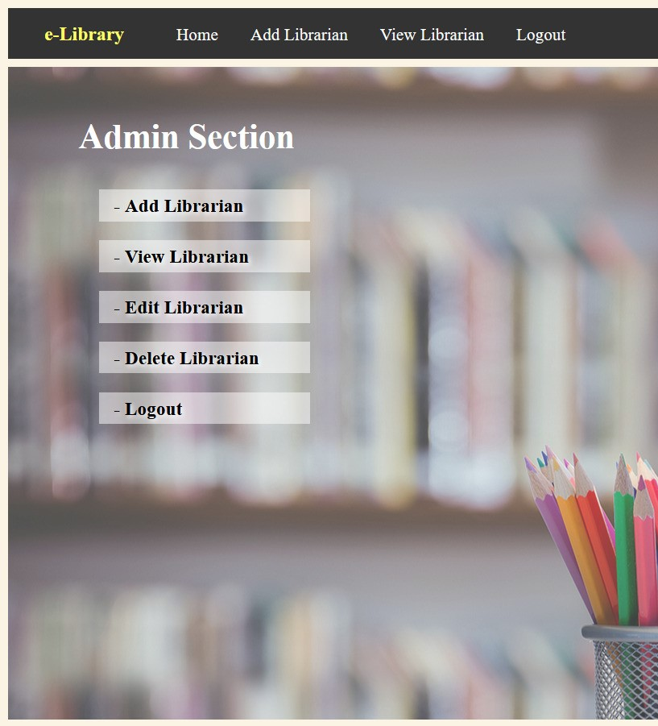
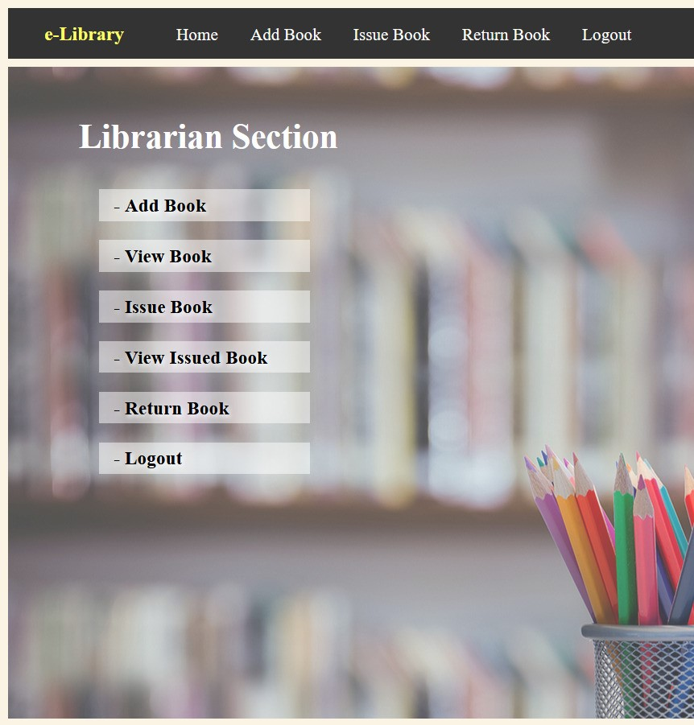
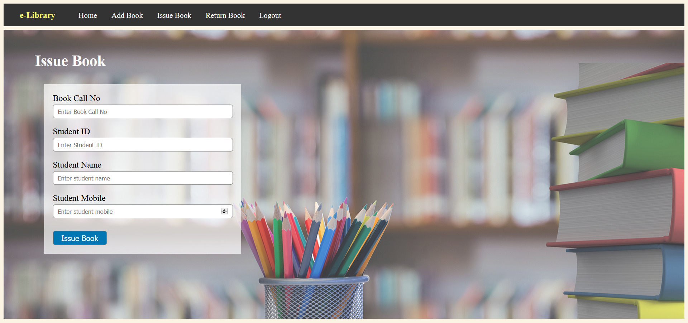

# e-Library

A <b>Library Management System</b> that covers all the specifications required to administer libraries. It requires Admin and Librarians to login initially and perform their specified tasks.

## Users & Tasks

1. **Admin** 
  ~ Add Librarian 
  ~ View Librarian 
  ~ Edit Librarian 
  ~ Delete Librarian 
  ~ Logout  
2. **Librarian** 
  ~ Add Book 
  ~ View Book 
  ~ Issue Book 
  ~ View Issued Book 
  ~ Return Book 
  ~ Logout 

## Screenshots

<h4>Login Page</h4>

<table>
  <tr>
    <th>Admin Section</th>
    <th>Librarian Section</th>
  </tr>
  <tr>
    <td></td>
    <td></td>
  </tr>
</table>

<h4>Issue Book Form</h4>

## Built With

- Servlet
- JDBC
- HTML, CSS
- JSP
- Oracle

***IDE used : Eclipse [Enterprise Edition]***

## Setup

1. Clone the repository.

2. Import following jar files to the project:
    * Servlet jar file
    * Oracle DB jar file

3. You can see commands from [oracle.txt](oracle.txt) to create each table manually in Oracle database.

4. Run the project on server.

5. To login as admin, use : 
    `Email: admin1@gmail.com`,
    `Password: 123456`

## Contributing

Please read [CONTRIBUTING.md](CONTRIBUTING.md) for details on the process for submitting pull requests to us.

## License

This project is licensed under the MIT License - see the [LICENSE](LICENSE) file for details